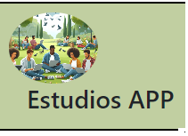
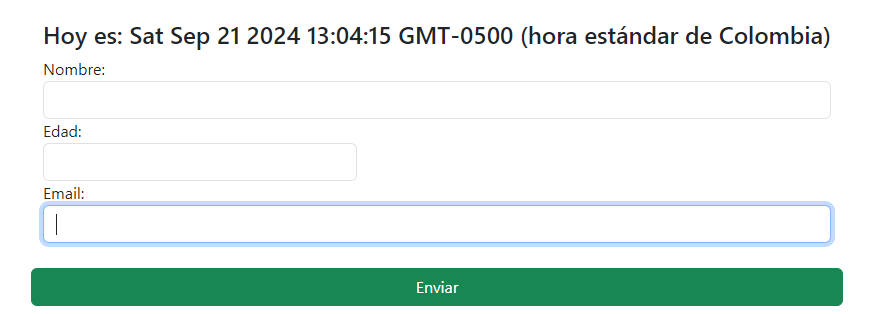
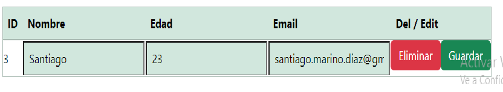
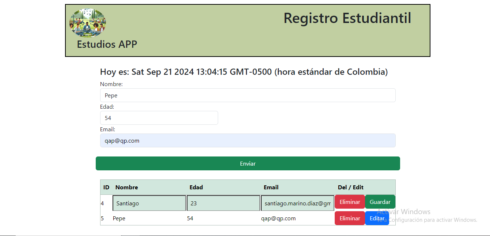

<h1 align="center">CRUD ESTUDENT APP TALENTO TECH</h1>
<h2 align="center">Registro de ESTUDIANTES</h2>

## Tabla de contenido 
1. [Introducción](#introducción)
2. [Característricas](#características)
3. [Tecnologías utilizadas](#tecnologías-utilizadas)
4. [Como usar la App](#como-usar-la-app)
5. [Codigo](#código)
6. [Despliegue](#despliegue)
7. [Colaboradores](#colaboradores)
   
## Introducción

Esta aplicación web ha sido diseñada para facilitar el registro y gestión de los estudiantes de nuestra institución. Permite añadir nuevos estudiantes a la base de datos, editar la información existente, y marcar aquellos registros que deban ser eliminados. Además, ofrece una interfaz intuitiva que posibilita la modificación detallada de los datos de cada estudiante a través de ventanas modales.


## Características

 - Registrar nueva información: Captura datos esenciales como nombre completo, edad y correo electrónico de cada estudiante.
- Editar registros: Modifica los datos existentes de cualquier estudiante de forma sencilla a través de una ventana modal, sin necesidad de recargar la página.
- Gestionar el estado de los registros: Marca a los estudiantes como "inactivos" para dar de baja sus cuentas, deshabilitando automáticamente la opción de edición.
- Asegurar la integridad de los datos: Valida que el formato del correo electrónico sea correcto y convierte automáticamente los nombres a formato Camel Case para mantener una base de datos ordenada.

## Tecnologías Utilizadas

- HTML
- CSS
- JavaScript

## Como usar la App

1. **Registro de un médico:**
   - Introduce el nombre, el email y la edad del estudiante en el formulario y haz clic en "enviar".
   - El estudiante se añadirá a la lista con la informacion correspondiente.

     

2. **Editar los detalles de un médico:**
   - Haz clic en el botón "Editar" de la fila correspondiente.
   - Se abrirá una el espacio donde podrás modificar el nombre, la edad y el email.
   - Haz clic en "Guardar" para aplicar las modificaciones.

     

3. **Marcar a un médico como "Eliminar":**
   - Haz clic en el botón "Eliminar" de la fila correspondiente.
   - La fila se eliminara la tabla sin posibilidad de modificar

   

4. **Resultado final al manejar el crud**

   

## Código
El codigo que se utilizo fue el standard para HTML, CSS, JAVASCRIPT.
Para versiones nuevas se manejarán archivos, en formato JSON, con MongoDb, 
o con bases de datos relacionales, en un servidor XAMPP y una base de datos de MySql.

## HTML ##

```html
<!DOCTYPE html>
<html>

<head>
  <meta charset="utf-8">
  <meta name="viewport" content="width=device-width">
  <title>CRUD-APP</title>
  <link href="style.css" rel="stylesheet" type="text/css" />
  <link href="https://cdn.jsdelivr.net/npm/bootstrap@5.3.3/dist/css/bootstrap.min.css" rel="stylesheet" integrity="sha384-QWTKZyjpPEjISv5WaRU9OFeRpok6YctnYmDr5pNlyT2bRjXh0JMhjY6hW+ALEwIH" crossorigin="anonymous">
  <script src="https://cdn.jsdelivr.net/npm/bootstrap@5.3.3/dist/js/bootstrap.bundle.min.js" integrity="sha384-YvpcrYf0tY3lHB60NNkmXc5s9fDVZLESaAA55NDzOxhy9GkcIdslK1eN7N6jIeHz" crossorigin="anonymous"></script>
</head>


  <main>
    <div class="head-log">
      <header>
        <div class="figure">
          
          <h3>Estudios APP</h3>
        </div>
        <h1>Registro Estudiantil</h1>
      </header>
    </div>
    <div class="main-content">
      <div class="form-content">
      <h4 id="date">Esta es la fecha de hoy: *****</h4>
        <form class="row" id="st-form">
          <label  for="name">
            Nombre: 
            <input class="form-control"type="text" name="name" id="name">
          </label>
          <label class="col-sm-5" for="age">
            Edad: 
            <input class="form-control"type="number" name="age" id="age">
          </label>
          <label for="email">
            Email: 
            <input class="form-control"type="email" name="email" id="email">
          </label>
          <button id="sub" class="btn btn-success boton"type="submit">Enviar</button>
        </form>
      </div>
      <div class="table-container">
        <table id="tableStudnet" class="table table-success table-striped">
          <thead>
            <tr>
              <th>ID</th>
              <th>Nombre</th>
              <th>Edad</th>
              <th>Email</th>
              <th id="tbn-del">Del / Edit</th>
            </tr>
          </thead>
        </table>
      </div>
    </div>

  </main>
    
  <script src="script.js"></script>
</body>

</html>
```


## Colaboradores

* Santiago Mariño
  
## Sept, 2024 &#169; ##
    
